# ft-transcendence


<i>
  <p>
    This project is about doing something you’ve never done before.
  </p>
  <p>
    Remind yourself the beginning of your journey in computer science.
  </p>
  <p>
    Look at you now. Time to shine!
  </p>
</i>

#### <i>[subject](_subject/en.subject.pdf) v.15</i>

## 📌 -  Dependencies (for Ubuntu 24.04LTS)

- docker
``` sh
sudo apt-get update
sudo apt-get install ca-certificates curl
sudo install -m 0755 -d /etc/apt/keyrings
sudo curl -fsSL https://download.docker.com/linux/ubuntu/gpg -o /etc/apt/keyrings/docker.asc
sudo chmod a+r /etc/apt/keyrings/docker.asc
echo \
  "deb [arch=$(dpkg --print-architecture) signed-by=/etc/apt/keyrings/docker.asc] https://download.docker.com/linux/ubuntu \
  $(. /etc/os-release && echo "$VERSION_CODENAME") stable" | \
  sudo tee /etc/apt/sources.list.d/docker.list > /dev/null
sudo apt-get update
sudo apt-get install docker-ce docker-ce-cli containerd.io docker-buildx-plugin docker-compose-plugin
```

- make
``` sh
sudo apt install make
```

## 🛠️ - Usage
```
git clone https://github.com/kichkiro/ft_transcendence.git
cd ft_transcendence/project
```
- make up:
  - create images
  - create volumes
  - create networks 
  - start containers
- make down: 
  - stop containers
  - remove containers
- make stop: 
  - stop containers
- make start: 
  - start containers
- make clean:
  - remove all containers
  - remove specified images (can specify with "make [re|clean] IMAGES=<image_name> ...", otherwise removes all images)
  - remove all volums
- make fclean:
  - make clean
  - remove all networks
  - remove all build cache
- make re:
  - make clean
  - make up

## 🐋- Docker Infrastracture

<!-- add the following code to topology.svg for white background 
  <rect width="100%" height="100%" fill="white"/> -->



## 🛡️ Security

Below are the security measures that have been taken to protect the infrastructure:

- __Network Segmentation__: All east-west traffic in the docker infrastructure was dropped by default through the OS firewall iptables.

- __Web Application Firewall__: ModSecurity's WAF has been implemented as a module of Nginx, it serves to protect the web application from common attacks and vulnerabilities, such as SQL injection, cross-site scripting (XSS) and other known threats.

- __Non-Root Containers__: VMware Bitnami images were used, renowned for its additional security over the official images, including non-root user by default. 

- __Hashicorp Vault__:

- __SSL Certs__:

## 📚 - References
- Log System
  - [The Complete Guide to the ELK Stack](https://logz.io/learn/complete-guide-elk-stack/#what-elk-stack)
  - [Docker ELK](https://github.com/deviantony/docker-elk)
- Monitor System
  - [Provision dashboards and data sources](https://grafana.com/tutorials/provision-dashboards-and-data-sources/)
  - [Dashboard API](https://grafana.com/docs/grafana/latest/developers/http_api/dashboard/)
  - [Prometheus Alert Manager Setup and Alert Configurations (Slack)](https://medium.com/@krishabh080/prometheus-alert-manager-setup-and-alert-configurations-slack-800f6bb5111e)
  - [How to secure Grafana?](https://www.squadcast.com/questions/how-to-secure-grafana)
- Vault
  - [Hashicorp Vault - Tutorials](https://developer.hashicorp.com/vault/tutorials)
  - [Hashicorp Vault - Documentation](https://developer.hashicorp.com/vault/docs)
  - [Hashicorp Vault - Build your own certificate authority (CA)](https://developer.hashicorp.com/vault/tutorials/secrets-management/pki-engine)
- Bitnami Images
  - [Postgresql](https://github.com/bitnami/containers/tree/main/bitnami/postgresql)
  - [Elasticsearch](https://github.com/bitnami/containers/tree/main/bitnami/elasticsearch)
  - [Logstash](https://github.com/bitnami/containers/tree/main/bitnami/logstash)
  - [Kibana](https://github.com/bitnami/containers/tree/main/bitnami/kibana)
  - [Vault](https://github.com/bitnami/containers/tree/main/bitnami/vault)

## ⚖️ - License
See [LICENSE](https://github.com/kichkiro/webserv/blob/main/LICENSE)

<br>

Work in Progress ...
